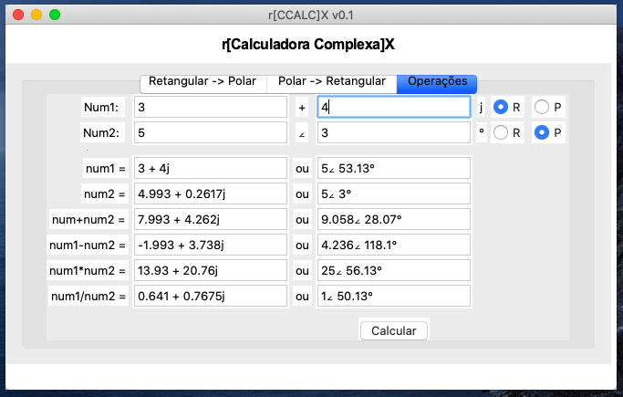

rx-ccalc  -  Complex Calculator
-------------------------------

This is a python3/tk written calculator software to make operations with complex numbers.

Features:
- Rectangular -> Polar conversion
- Polar -> Rectangular conversion
- Engineering mode awnsers
- Summation, Subtract, Multiply and Divide operations
- Brazillian Portuguese (pt_BR) interface 

Binaries:
- Windows 10 - 64bits 
- MacOS Mojave

Screenshot
----------

